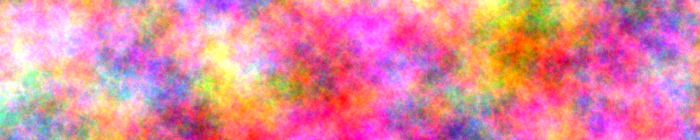

<div align="center">

***`noise`***<br>`2.0`

[](https://github.com/tayloraswift/swift-noise/actions/workflows/Tests.yml)
[](https://github.com/tayloraswift/swift-noise/actions/workflows/Documentation.yml)



</div>

**`swift-noise`** is a free, pure Swift procedural noise generation library. The library product has no dependencies and does not import Foundation or any system frameworks.

All popular types of procedural noise are supported, including three [gradient noises](https://en.wikipedia.org/wiki/Perlin_noise) (often called Perlin or simplex noises), and two [cellular noises](https://en.wikipedia.org/wiki/Worley_noise) (sometimes called Worley or Voronoi noises).

`swift-noise` includes a [fractal brownian motion](https://thebookofshaders.com/13/) (FBM) noise composition framework, and a [disk point sampler](https://en.wikipedia.org/wiki/Supersampling#Poisson_disc) (often called a Poisson sampler), for generating visually even point distributions in the plane. `swift-noise` also includes pseudo-random number generation and hashing tools.

`swift-noise`’s entire public API is [documented](https://swiftinit.org/docs/swift-noise/noise).


## Requirements

The swift-noise library requires Swift 5.10 or later.

<!-- DO NOT EDIT BELOW! AUTOSYNC CONTENT [STATUS TABLE] -->
| Platform | Status |
| -------- | ------|
| 💬 Documentation | [](https://github.com/tayloraswift/swift-noise/actions/workflows/Documentation.yml) |
| 🐧 Linux | [](https://github.com/tayloraswift/swift-noise/actions/workflows/Tests.yml) |
| 🍏 Darwin | [](https://github.com/tayloraswift/swift-noise/actions/workflows/Tests.yml) |
| 🍏 Darwin (iOS) | [](https://github.com/tayloraswift/swift-noise/actions/workflows/Tests.yml) |
| 🍏 Darwin (tvOS) | [](https://github.com/tayloraswift/swift-noise/actions/workflows/Tests.yml) |
| 🍏 Darwin (visionOS) | [](https://github.com/tayloraswift/swift-noise/actions/workflows/Tests.yml) |
| 🍏 Darwin (watchOS) | [](https://github.com/tayloraswift/swift-noise/actions/workflows/Tests.yml) |
<!-- DO NOT EDIT ABOVE! AUTOSYNC CONTENT [STATUS TABLE] -->

[Check deployment minimums](https://swiftinit.org/docs/swift-noise#ss:platform-requirements)


## Building

Build *Noise* with the Swift Package Manager. *Noise* itself has no dependencies, but the tests use

The package includes an executable, `generate-noise`, that depends on [`swift-png`](https://github.com/tayloraswift/swift-png).
It generates noise locally for visual inspection.
To regenerate example images, run the following command in the terminal:

```
swift run -c release generate-noise
```

