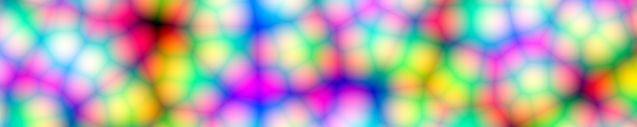

###### Structure

# `CellNoise2D`
A type of two-dimensional cellular noise (sometimes called [Worley noise](https://en.wikipedia.org/wiki/Worley_noise), or Voronoi noise), suitable for texturing two-dimensional planes.

Unlike many other cell noise implementations, *Noise*’s implementation samples all relevant generating-points, preventing artifacts or discontinuities from ever appearing in the noise. Accordingly, *Noise*’s implementation is heavily optimized to prevent the additional edge cases from impacting the performance of the cell noise.

Cell noise has a three-dimensional version, [`CellNoise3D`](struct-CellNoise3D.md).

***

## Symbols

### Initializers

#### [`init`](protocol-Noise.md#initamplitudedouble-frequencydouble-seedint)`(amplitude:Double, frequency:Double, seed:Int = 0)`
> Creates an instance with the given `amplitude`, `frequency`, and random `seed` values. Creating an instance generates a new pseudo-random permutation table for that instance, and a new instance does not need to be regenerated to sample the same procedural noise field.

> The given amplitude is adjusted internally to produce output *exactly* within the range of `0 ... amplitude`. However, in practice the cell noise rarely reaches the maximum threshold, as it is often useful to inflate the amplitude to get the desired appearance.

### Instance methods

#### `func` `closest_point(_ x:Double, _ y:Double) -> (point:(Int, Int), r2:Double)`
> Returns the index numbers of the closest feature point to the given coordinate, and the squared distance from the given coordinate to the feature point. These index numbers can be fed to a color hashing function to produce a [Voronoi diagram](https://en.wikipedia.org/wiki/Voronoi_diagram).

#### `func` [`evaluate`](protocol-Noise.md#func-evaluate_-xdouble-_-ydouble---double)`(_ x:Double, _ y:Double) -> Double`
> Evaluates the cell noise field at the given coordinates.

#### `func` [`evaluate`](protocol-Noise.md#func-evaluate_-xdouble-_-ydouble-_-zdouble---double)`(_ x:Double, _ y:Double, _:Double) -> Double`
> Evaluates the cell noise field at the given coordinates. The third coordinate is ignored.

#### `func` [`evaluate`](protocol-Noise.md#func-evaluate_-xdouble-_-ydouble-_-zdouble-_-wdouble---double)`(_ x:Double, _ y:Double, _:Double, _:Double) -> Double`
> Evaluates the cell noise field at the given coordinates. The third and fourth coordinates are ignored.

#### `func` [`sample_area`](protocol-Noise.md#func-sample_areawidthint-heightint---double-double-double)`(width:Int, height:Int) -> [(Double, Double, Double)]`
> Evaluates the noise field over the given area, starting from the origin, and extending over the first quadrant, taking unit steps in both directions. Although the `x` and `y` coordinates are returned, the output vector is guaranteed to be in row-major order.

#### `func` [`sample_area_saturated_to_u8`](protocol-Noise.md#func-sample_area_saturated_to_u8widthint-heightint-offsetdouble--05---uint8)`(width:Int, height:Int, offset:Double = 0.5) -> [UInt8]`
> Evaluates the noise field over the given area, starting from the origin, and extending over the first quadrant, storing the values in a row-major array of samples. The samples are clamped, but not scaled, to the range `0 ... 255`.

#### `func` [`sample_volume`](protocol-Noise.md#func-sample_volumewidthint-heightint-depthint---double-double-double-double)`(width:Int, height:Int, depth:Int) -> [(Double, Double, Double, Double)]`
> Evaluates the noise field over the given volume, starting from the origin, and extending over the first octant, taking unit steps in all three directions. Although the `x`, `y`, and `z` coordinates are returned, the output vector is guaranteed to be in `xy`-plane-major, and then row-major order.

#### `func` [`sample_volume_saturated_to_u8`](protocol-Noise.md#func-sample_volume_saturated_to_u8widthint-heightint-depthint-offsetdouble--05---uint8)`(width:Int, height:Int, depth:Int, offset:Double = 0.5) -> [UInt8]`
> Evaluates the noise field over the given volume, starting from the origin, and extending over the first octant, storing the values in a `xy`-plane-major, and then row-major order array of samples. The samples are clamped, but not scaled, to the range `0 ... 255`.

## Relationships

### Conforms to

#### [`Noise`](protocol-Noise.md)
