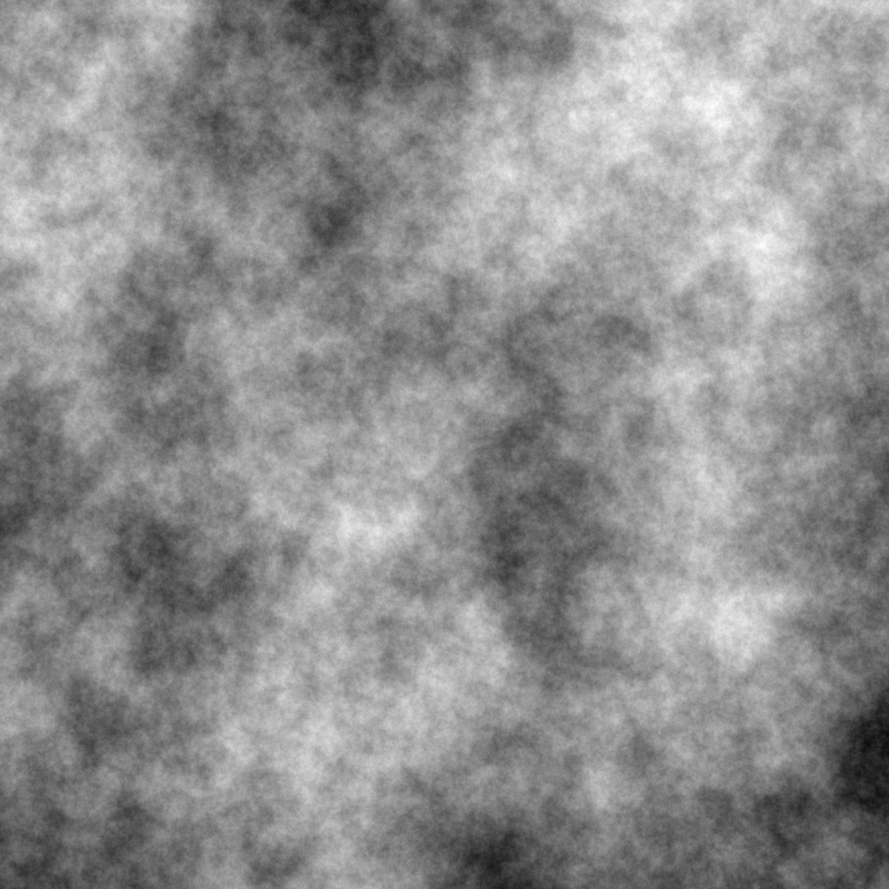

# noise

*Noise-swift* will eventually be a free, native Swift procedural noise generation library. It will be free of Foundation or any other Apple framework. Currently supported:

* Simplex noise (2D)

    Simplex noise is an improved version of the classical [Perlin noise](https://en.wikipedia.org/wiki/Perlin_noise) algorithm. Noise-swift uses the OpenSimplex procedural noise generation algorithm, which solves many of the quality issues apparent in the 3D version of the proprietary Simplex noise algorithm, as well as sidestepping potential patent threats.

* SuperSimplex noise (2D)

    SuperSimplex noise is yet another improvement on Simplex noise that results in even noise with fewer artifacts. SuperSimplex noise also runs slightly (~5%) faster than Simplex noise. Many thanks to the Java and [Rust OpenSimplex communities](https://github.com/brendanzab/noise-rs) for their assistance, which was essential for bringing SuperSimplex procedural noise to Swift.

* SuperSimplex noise (3D)

    3D SuperSimplex volumetric noise, suitable for texturing any 3D object without seams or texture unwrapping.

* Poisson sample noise (2D)

    Two dimensional point noise with a visually uniform distribution, and no clumping.

### A note on building

Noise-swift does not actually depend on [maxpng](https://github.com/kelvin13/maxpng), my free Swift PNG library; it is only being used to view the output of the noise generator as a PNG. For similar reasons, this repository currently contains a small Cairo interface library, which will probably be spun-off into a library of its own right once Noise-swift matures.
