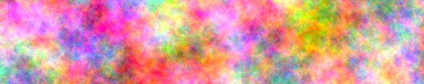

# noise

**Noise** is a free, pure Swift procedural noise generation library. It is free of Foundation or any other Apple framework, and has no dependencies. All popular types of procedural noise are supported, including three [gradient noises](https://en.wikipedia.org/wiki/Perlin_noise) (often called Perlin or simplex noises), and two [cellular noises](https://en.wikipedia.org/wiki/Worley_noise) (sometimes called Worley or Voronoi noises). *Noise* includes a [fractal brownian motion](https://thebookofshaders.com/13/) (FBM) noise composition framework, and a [disk point sampler](https://en.wikipedia.org/wiki/Supersampling#Poisson_disc) (often called a Poisson sampler), for generating visually even point distributions in the plane. *Noise* also includes pseudo-random number generation and hashing tools.

***Noise*’s entire public API is [documented](https://github.com/kelvin13/noise/wiki).**

## Building

Build *Noise* with the Swift Package Manager. *Noise* itself has no dependencies, but the tests depend on [MaxPNG](https://github.com/kelvin13/maxpng), my free Swift PNG library, to view the generated noise.
